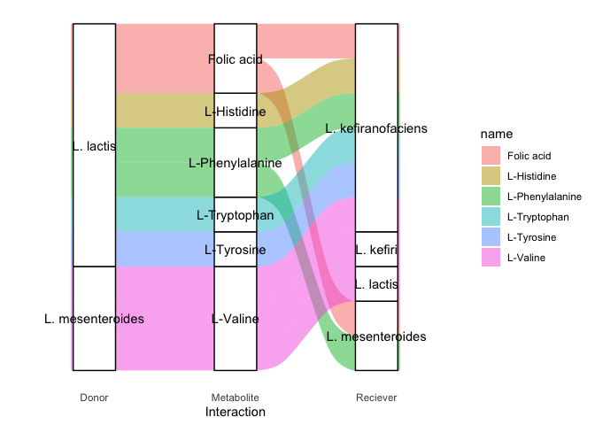
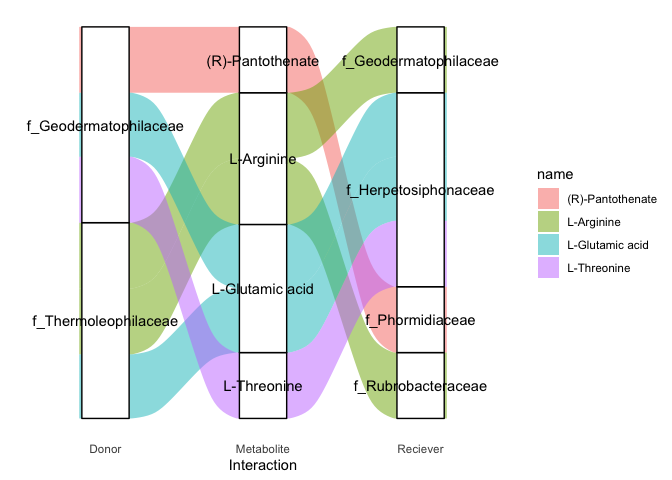

📈 4. Visualize detailed interactions with alluvial diagrams
================
Francisco Zorrilla
15/01/2022

You are now familiar with how the SMETANA detailed algorithm works, next
we will inspect the output interaction predictions. This R-markdown
document loads the summary file `smet_all.tsv` with 100 simulations for
each community, plus any that you may have added. You may follow along
passively on GitHub or launch the R-markdown document from Rstudio to
interactively run through each code chunk.

## Packages

``` r
library(tidyverse) # data manipulation
```

    ## ── Attaching packages ─────────────────────────────────────── tidyverse 1.3.1 ──

    ## ✓ ggplot2 3.3.5     ✓ purrr   0.3.4
    ## ✓ tibble  3.1.5     ✓ dplyr   1.0.7
    ## ✓ tidyr   1.1.4     ✓ stringr 1.4.0
    ## ✓ readr   2.0.2     ✓ forcats 0.5.1

    ## Warning: package 'tibble' was built under R version 4.1.1

    ## Warning: package 'tidyr' was built under R version 4.1.1

    ## Warning: package 'readr' was built under R version 4.1.1

    ## ── Conflicts ────────────────────────────────────────── tidyverse_conflicts() ──
    ## x dplyr::filter() masks stats::filter()
    ## x dplyr::lag()    masks stats::lag()

``` r
library(ggpubr) # statistical testing and figure manipulation
library(ggalluvial) # easy alluvial diagrams
```

## SMETANA detailed interactions

We will now generate sankey/alluvial diagrams using the metabolic
predictions from SMETANA.

``` r
## Set working directory inside scripts folder of cloned repo
#setwd("~/path/to/SymbNET/scripts")

# Load data & take average across simulations within each community, remember to unzip smet_all.tsv.gz!
smet_all <- read.delim("../data/smet_all.tsv") %>% 
     select(-medium) %>% 
     group_by(community,compound,receiver,donor) %>% 
     mutate(ave_smet = mean(smetana),sd_smet=sd(smetana)) %>%
     ungroup() %>%
     select(-simulation,-mps,-mus,-scs,-smetana) %>%
     unique() %>%
     filter(ave_smet!=0) %>%
     mutate(community=as.factor(community))%>%
     mutate(receiver=as.factor(receiver))%>%
     mutate(donor=as.factor(donor))%>%
     mutate(compound=as.factor(compound)) %>%
     mutate(compound=gsub("M_","",compound)) %>%
     mutate(compound=gsub("_e","",compound))

# Load in some taxonomy metadata
smetana_don <- read.delim("../data/smetana_donors.tsv")
smetana_rec <- read.delim("../data/smetana_receivers.tsv")

smet_all<- left_join(left_join(smet_all,smetana_don,by="donor"),smetana_rec,by="receiver")%>%
     mutate(taxonomy_donor=as.factor(taxonomy_donor))%>%
     mutate(taxonomy_receiver=as.factor(taxonomy_receiver))

# Load in some metabolite metadata
smetana_met <- read.delim("../data/bigg_classes.txt")
smet_all <- left_join(smet_all,smetana_met,by="compound")%>%
     mutate(name=as.factor(name))%>%
     mutate(super_class=as.factor(super_class))%>%
     mutate(class=as.factor(class))%>%
     mutate(sub_class=as.factor(sub_class))%>%
     drop_na()%>%
     unique()

# Summary from data manipulation
summary(smet_all)
```

    ##         community     receiver            donor             compound        
    ##  gut_impaired:136   Length:1432        Length:1432        Length:1432       
    ##  gut_normal  :112   Class :character   Class :character   Class :character  
    ##  gut_refseq  :165   Mode  :character   Mode  :character   Mode  :character  
    ##  gut_t2d     :349                                                           
    ##  kefir       :319                                                           
    ##  soil        :351                                                           
    ##                                                                             
    ##     ave_smet            sd_smet                      taxonomy_donor
    ##  Min.   :0.0000344   Min.   :0.000000   B. wexlerae         :268   
    ##  1st Qu.:0.0053608   1st Qu.:0.006974   B. uniformis        :214   
    ##  Median :0.0281186   Median :0.028747   E. rectale          :122   
    ##  Mean   :0.1192487   Mean   :0.066600   L. lactis           : 96   
    ##  3rd Qu.:0.1249512   3rd Qu.:0.086899   f_Thermoleophilaceae: 90   
    ##  Max.   :1.0000000   Max.   :0.500000   F. saccharivorans   : 89   
    ##                                         (Other)             :553   
    ##          taxonomy_receiver               name     
    ##  R. bromii        :238     Hydrogen Ion    :  74  
    ##  E. rectale       :196     Acetaldehyde    :  73  
    ##  F. saccharivorans:138     Hydrogen sulfide:  66  
    ##  B. uniformis     :105     Ammonia         :  65  
    ##  B. wexlerae      : 85     Ammonium        :  65  
    ##  f_Phormidiaceae  : 85     D-Alanine       :  62  
    ##  (Other)          :585     (Other)         :1027  
    ##                           super_class 
    ##  Homogeneous non-metal compounds:591  
    ##  Organic acids and derivatives  :541  
    ##  Organic oxygen compounds       :162  
    ##  Homogeneous metal compounds    : 36  
    ##  Organic nitrogen compounds     : 25  
    ##  Organoheterocyclic compounds   : 21  
    ##  (Other)                        : 56  
    ##                                     class    
    ##  Carboxylic acids and derivatives      :488  
    ##  Non-metal oxoanionic compounds        :230  
    ##  Homogeneous other non-metal compounds :188  
    ##  Other non-metal organides             :173  
    ##  Organooxygen compounds                :162  
    ##  Homogeneous transition metal compounds: 36  
    ##  (Other)                               :155  
    ##                                 sub_class  
    ##  Amino acids, peptides, and analogues:462  
    ##                                      :226  
    ##  Non-metal phosphates                :172  
    ##  Other non-metal hydrides            : 79  
    ##  Carbonyl compounds                  : 73  
    ##  Other non-metal sulfides            : 66  
    ##  (Other)                             :354

# Kefir community

We already have some clues as to what interactions may be occurring in
this community from the original publication (see,
<https://www.nature.com/articles/s41564-020-00816-5>). As an exploratory
first step, plot the distribution of average SMETANA scores across
metabolites.

``` r
ggplot(smet_all %>% filter(community =="kefir"),aes(x=reorder(name,ave_smet),y=ave_smet)) + geom_boxplot() + coord_flip()
```

<!-- -->

Let’s plot all interactions with high SMETANA score

``` r
ggplot(smet_all %>% filter(community =="kefir",ave_smet>=0.90),
       aes(axis1 = taxonomy_donor, axis2 = name, axis3 = taxonomy_receiver,
           y = ave_smet)) +
    scale_x_discrete(limits = c("Donor", "Metabolite", "Reciever")) +
    xlab("Interaction") +
    geom_alluvium(aes(fill = name)) +
    geom_stratum(width=0.3) +
    theme_minimal() + geom_text(stat = "stratum", aes(label = after_stat(stratum)),min.y=0.2)+theme_bw() + 
    theme(panel.border = element_blank(), panel.grid.major = element_blank(),panel.grid.minor = element_blank(), axis.line = element_line(colour = "black"),axis.line.y = element_blank(),axis.ticks.y = element_blank(),axis.text.y = element_blank(),axis.title.y = element_blank(),axis.line.x = element_blank(),axis.ticks.x = element_blank())
```

    ## Warning in to_lodes_form(data = data, axes = axis_ind, discern =
    ## params$discern): Some strata appear at multiple axes.

    ## Warning in to_lodes_form(data = data, axes = axis_ind, discern =
    ## params$discern): Some strata appear at multiple axes.

    ## Warning in to_lodes_form(data = data, axes = axis_ind, discern =
    ## params$discern): Some strata appear at multiple axes.

<!-- -->

Filter down to some metabolites of interest to get a more interpretable
plot

``` r
mets = c("L-Valine","L-Tyrosine","L-Tryptophan","L-Histidine","L-Phenylalanine","Folic acid")

ggplot(smet_all %>% filter(community =="kefir",name%in%mets, ave_smet>=0.90),
       aes(axis1 = taxonomy_donor, axis2 = name, axis3 = taxonomy_receiver,
           y = ave_smet)) +
    scale_x_discrete(limits = c("Donor", "Metabolite", "Reciever")) +
    xlab("Interaction") +
    geom_alluvium(aes(fill = name)) +
    geom_stratum(width=0.3) +
    theme_minimal() + geom_text(stat = "stratum", aes(label = after_stat(stratum)),min.y=0.2)+theme_bw() + 
    theme(panel.border = element_blank(), panel.grid.major = element_blank(),panel.grid.minor = element_blank(), axis.line = element_line(colour = "black"),axis.line.y = element_blank(),axis.ticks.y = element_blank(),axis.text.y = element_blank(),axis.title.y = element_blank(),axis.line.x = element_blank(),axis.ticks.x = element_blank())
```

    ## Warning in to_lodes_form(data = data, axes = axis_ind, discern =
    ## params$discern): Some strata appear at multiple axes.

    ## Warning in to_lodes_form(data = data, axes = axis_ind, discern =
    ## params$discern): Some strata appear at multiple axes.

    ## Warning in to_lodes_form(data = data, axes = axis_ind, discern =
    ## params$discern): Some strata appear at multiple axes.

<!-- -->

# Soil community

``` r
ggplot(smet_all %>% filter(community =="soil"),aes(x=reorder(name,ave_smet),y=ave_smet)) + geom_boxplot() + coord_flip()
```

<!-- -->

Let’s plot all interactions with high SMETANA score

``` r
ggplot(smet_all %>% filter(community =="soil",ave_smet>=0.90),
       aes(axis1 = taxonomy_donor, axis2 = name, axis3 = taxonomy_receiver,
           y = ave_smet)) +
    scale_x_discrete(limits = c("Donor", "Metabolite", "Reciever")) +
    xlab("Interaction") +
    geom_alluvium(aes(fill = name)) +
    geom_stratum(width=0.3) +
    theme_minimal() + geom_text(stat = "stratum", aes(label = after_stat(stratum)),min.y=0.2)+theme_bw() + 
    theme(panel.border = element_blank(), panel.grid.major = element_blank(),panel.grid.minor = element_blank(), axis.line = element_line(colour = "black"),axis.line.y = element_blank(),axis.ticks.y = element_blank(),axis.text.y = element_blank(),axis.title.y = element_blank(),axis.line.x = element_blank(),axis.ticks.x = element_blank())
```

    ## Warning in to_lodes_form(data = data, axes = axis_ind, discern =
    ## params$discern): Some strata appear at multiple axes.

    ## Warning in to_lodes_form(data = data, axes = axis_ind, discern =
    ## params$discern): Some strata appear at multiple axes.

    ## Warning in to_lodes_form(data = data, axes = axis_ind, discern =
    ## params$discern): Some strata appear at multiple axes.

<!-- -->

Filter down to some metabolites of interest to get a more interpretable
plot

``` r
mets = c("(R)-Pantothenate","L-Glutamic acid","L-Arginine","L-Threonine")

ggplot(smet_all %>% filter(community =="soil",name%in%mets,ave_smet>=0.90),
       aes(axis1 = taxonomy_donor, axis2 = name, axis3 = taxonomy_receiver,
           y = ave_smet)) +
    scale_x_discrete(limits = c("Donor", "Metabolite", "Reciever")) +
    xlab("Interaction") +
    geom_alluvium(aes(fill = name)) +
    geom_stratum(width=0.3) +
    theme_minimal() + geom_text(stat = "stratum", aes(label = after_stat(stratum)),min.y=0.2)+theme_bw() + 
    theme(panel.border = element_blank(), panel.grid.major = element_blank(),panel.grid.minor = element_blank(), axis.line = element_line(colour = "black"),axis.line.y = element_blank(),axis.ticks.y = element_blank(),axis.text.y = element_blank(),axis.title.y = element_blank(),axis.line.x = element_blank(),axis.ticks.x = element_blank())
```

    ## Warning in to_lodes_form(data = data, axes = axis_ind, discern =
    ## params$discern): Some strata appear at multiple axes.

    ## Warning in to_lodes_form(data = data, axes = axis_ind, discern =
    ## params$discern): Some strata appear at multiple axes.

    ## Warning in to_lodes_form(data = data, axes = axis_ind, discern =
    ## params$discern): Some strata appear at multiple axes.

<!-- -->

### Human gut microbiome community

Subset object for easier manipulation/plotting

``` r
smet_gut <- smet_all %>% filter(community!="soil",community!="kefir")
```

``` r
ggplot(smet_gut, aes(x=reorder(name,ave_smet),y=ave_smet)) + geom_boxplot() + facet_wrap(~community,scales="free") + coord_flip()
```

<!-- -->

Notice the x-axis on the `refseq` subplot, very low confidence
predictions were generated with reference-genome-based-models! Let’s
plot all interactions with SMETANA score &gt; 0.5 so that we can see the
top predicted refseq model interactions

``` r
ggplot(smet_gut %>% filter(ave_smet>=0.50),
       aes(axis1 = taxonomy_donor, axis2 = name, axis3 = taxonomy_receiver,
           y = ave_smet)) +
    scale_x_discrete(limits = c("Donor", "Metabolite", "Reciever")) +
    xlab("Interaction") +
    geom_alluvium(aes(fill = community)) +
    geom_stratum(width=0.3) +
    theme_minimal() + geom_text(stat = "stratum", aes(label = after_stat(stratum)),min.y=0.2)+theme_bw() + 
    theme(panel.border = element_blank(), panel.grid.major = element_blank(),panel.grid.minor = element_blank(), axis.line = element_line(colour = "black"),axis.line.y = element_blank(),axis.ticks.y = element_blank(),axis.text.y = element_blank(),axis.title.y = element_blank(),axis.line.x = element_blank(),axis.ticks.x = element_blank())
```

    ## Warning in to_lodes_form(data = data, axes = axis_ind, discern =
    ## params$discern): Some strata appear at multiple axes.

    ## Warning in to_lodes_form(data = data, axes = axis_ind, discern =
    ## params$discern): Some strata appear at multiple axes.

    ## Warning in to_lodes_form(data = data, axes = axis_ind, discern =
    ## params$discern): Some strata appear at multiple axes.

<!-- -->

Plot all interactions with SMETANA score &gt; 0.9

``` r
ggplot(smet_gut %>% filter(ave_smet>=0.90),
       aes(axis1 = taxonomy_donor, axis2 = name, axis3 = taxonomy_receiver,
           y = ave_smet)) +
    scale_x_discrete(limits = c("Donor", "Metabolite", "Reciever")) +
    xlab("Interaction") +
    geom_alluvium(aes(fill = community)) +
    geom_stratum(width=0.3) +
    theme_minimal() + geom_text(stat = "stratum", aes(label = after_stat(stratum)),min.y=0.2)+theme_bw() + 
    theme(panel.border = element_blank(), panel.grid.major = element_blank(),panel.grid.minor = element_blank(), axis.line = element_line(colour = "black"),axis.line.y = element_blank(),axis.ticks.y = element_blank(),axis.text.y = element_blank(),axis.title.y = element_blank(),axis.line.x = element_blank(),axis.ticks.x = element_blank())
```

    ## Warning in to_lodes_form(data = data, axes = axis_ind, discern =
    ## params$discern): Some strata appear at multiple axes.

    ## Warning in to_lodes_form(data = data, axes = axis_ind, discern =
    ## params$discern): Some strata appear at multiple axes.

    ## Warning in to_lodes_form(data = data, axes = axis_ind, discern =
    ## params$discern): Some strata appear at multiple axes.

<!-- -->

Notice the observable differences in the metabolic exchange predictions
across different conditions. For example, we can see that *B. uniformis*
is an amino acid donor in disease states, while *B. wexlerae* is an
important donor in the healthy microbiome.

Filter out Fe2+ ion exchanges as pH-dependence is not accounted for in
models. These exchanges may be possible, but further domain knowledge is
needed to asses their feasibility.

``` r
ggplot(smet_gut %>% filter(ave_smet>=0.90,name!="Fe2+"),
       aes(axis1 = taxonomy_donor, axis2 = name, axis3 = taxonomy_receiver,
           y = ave_smet)) +
    scale_x_discrete(limits = c("Donor", "Metabolite", "Reciever")) +
    xlab("Interaction") +
    geom_alluvium(aes(fill = community)) +
    geom_stratum(width=0.3) +
    theme_minimal() + geom_text(stat = "stratum", aes(label = after_stat(stratum)),min.y=0.2)+theme_bw() + 
    theme(panel.border = element_blank(), panel.grid.major = element_blank(),panel.grid.minor = element_blank(), axis.line = element_line(colour = "black"),axis.line.y = element_blank(),axis.ticks.y = element_blank(),axis.text.y = element_blank(),axis.title.y = element_blank(),axis.line.x = element_blank(),axis.ticks.x = element_blank())
```

    ## Warning in to_lodes_form(data = data, axes = axis_ind, discern =
    ## params$discern): Some strata appear at multiple axes.

    ## Warning in to_lodes_form(data = data, axes = axis_ind, discern =
    ## params$discern): Some strata appear at multiple axes.

    ## Warning in to_lodes_form(data = data, axes = axis_ind, discern =
    ## params$discern): Some strata appear at multiple axes.

<!-- -->

## This is the end of part I of this tutorial, move on to [exercise 5](https://github.com/franciscozorrilla/SymbNET/blob/main/scripts/5.run_smetana_global_metrics.md)
