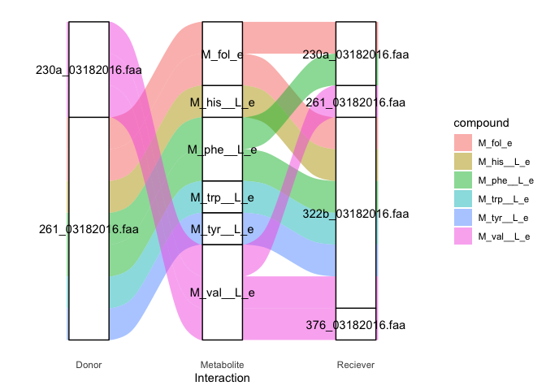

## 📶 4. Visualize deteailed interactions with alluvial diagrams
================
Francisco Zorrilla
15/01/2022

## Packages

``` r
library(tidyverse) # data manipulation
```

    ## ── Attaching packages ─────────────────────────────────────── tidyverse 1.3.1 ──

    ## ✓ ggplot2 3.3.5     ✓ purrr   0.3.4
    ## ✓ tibble  3.1.5     ✓ dplyr   1.0.7
    ## ✓ tidyr   1.1.4     ✓ stringr 1.4.0
    ## ✓ readr   2.0.2     ✓ forcats 0.5.1

    ## Warning: package 'tibble' was built under R version 4.1.1

    ## Warning: package 'tidyr' was built under R version 4.1.1

    ## Warning: package 'readr' was built under R version 4.1.1

    ## ── Conflicts ────────────────────────────────────────── tidyverse_conflicts() ──
    ## x dplyr::filter() masks stats::filter()
    ## x dplyr::lag()    masks stats::lag()

``` r
library(ggpubr) # statistical testing and figure manipulation
library(ggalluvial) # easy alluvial diagrams
```

## SMETANA detailed interactions

We will now generate sankey/alluvial diagrams using the metabolic
predictions from SMETANA.

``` r
## Set working directory inside scripts folder of cloned repo
#setwd("~/path/to/SymbNET/scripts")

# Load data & take average across simulations within each community, remember to unzip smet_all.tsv.gz!
smet_all <- read.delim("../data/smet_all.tsv") %>% 
     select(-medium) %>% 
     group_by(community,compound,receiver,donor) %>% 
     mutate(ave_smet = mean(smetana),sd_smet=sd(smetana)) %>%
     ungroup() %>%
     select(-simulation,-mps,-mus,-scs,-smetana) %>%
     unique() %>%
     filter(ave_smet!=0) %>%
     mutate(community=as.factor(community))%>%
     mutate(receiver=as.factor(receiver))%>%
     mutate(donor=as.factor(donor))%>%
     mutate(compound=as.factor(compound))

# Summary from data manipulation
summary(smet_all)
```

    ##         community                                         receiver  
    ##  gut_impaired:105   322b_03182016.faa                         : 76  
    ##  gut_normal  :100   376_03182016.faa                          : 75  
    ##  gut_refseq  :134   230a_03182016.faa                         : 74  
    ##  gut_t2d     :263   ERR671933_bin.3.s.faa                     : 70  
    ##  kefir       :301   ERR260140_bin.10.p.faa                    : 68  
    ##  soil        :284   GCF_002834225.1_ASM283422v1_protein.faa.gz: 68  
    ##                     (Other)                                   :756  
    ##                     donor           compound      ave_smet        
    ##  261_03182016.faa      : 82   M_h_e     : 74   Min.   :0.0000344  
    ##  ERR671933_bin.1.o.faa : 74   M_acald_e : 73   1st Qu.:0.0048700  
    ##  ERR260140_bin.11.s.faa: 71   M_h2s_e   : 66   Median :0.0267010  
    ##  ERR671933_bin.4.o.faa : 69   M_nh4_e   : 65   Mean   :0.1226602  
    ##  290_03182016.faa      : 68   M_ala__D_e: 62   3rd Qu.:0.1092500  
    ##  ERR260140_bin.13.s.faa: 68   M_h2o_e   : 58   Max.   :1.0000000  
    ##  (Other)               :755   (Other)   :789                      
    ##     sd_smet       
    ##  Min.   :0.00000  
    ##  1st Qu.:0.00589  
    ##  Median :0.02263  
    ##  Mean   :0.05531  
    ##  3rd Qu.:0.06925  
    ##  Max.   :0.50000  
    ## 

# Kefir community

We already have some clues as to what interactions may be occurring in
this community from the original publication (see,
<https://www.nature.com/articles/s41564-020-00816-5>). As an exploratory
first step, plot the distribution of average SMETANA scores across
metabolites.

``` r
ggplot(smet_all %>% filter(community =="kefir"),aes(x=reorder(compound,ave_smet),y=ave_smet)) + geom_boxplot() + coord_flip()
```

<!-- -->

Let’s plot all interactions with high SMETANA score

``` r
ggplot(smet_all %>% filter(community =="kefir",ave_smet>=0.90),
       aes(axis1 = donor, axis2 = compound, axis3 = receiver,
           y = ave_smet)) +
    scale_x_discrete(limits = c("Donor", "Metabolite", "Reciever")) +
    xlab("Interaction") +
    geom_alluvium(aes(fill = compound)) +
    geom_stratum(width=0.3) +
    theme_minimal() + geom_text(stat = "stratum", aes(label = after_stat(stratum)),min.y=0.2)+theme_bw() + 
    theme(panel.border = element_blank(), panel.grid.major = element_blank(),panel.grid.minor = element_blank(), axis.line = element_line(colour = "black"),axis.line.y = element_blank(),axis.ticks.y = element_blank(),axis.text.y = element_blank(),axis.title.y = element_blank(),axis.line.x = element_blank(),axis.ticks.x = element_blank())
```

    ## Warning in to_lodes_form(data = data, axes = axis_ind, discern =
    ## params$discern): Some strata appear at multiple axes.

    ## Warning in to_lodes_form(data = data, axes = axis_ind, discern =
    ## params$discern): Some strata appear at multiple axes.

    ## Warning in to_lodes_form(data = data, axes = axis_ind, discern =
    ## params$discern): Some strata appear at multiple axes.

<!-- -->

Filter down to some metabolites of interest to get a more interpretable
plot

``` r
mets = c("M_val__L_e","M_tyr__L_e","M_trp__L_e","M_his__L_e","M_phe__L_e","M_fol_e")

ggplot(smet_all %>% filter(community =="kefir",compound%in%mets, ave_smet>=0.90),
       aes(axis1 = donor, axis2 = compound, axis3 = receiver,
           y = ave_smet)) +
    scale_x_discrete(limits = c("Donor", "Metabolite", "Reciever")) +
    xlab("Interaction") +
    geom_alluvium(aes(fill = compound)) +
    geom_stratum(width=0.3) +
    theme_minimal() + geom_text(stat = "stratum", aes(label = after_stat(stratum)),min.y=0.2)+theme_bw() + 
    theme(panel.border = element_blank(), panel.grid.major = element_blank(),panel.grid.minor = element_blank(), axis.line = element_line(colour = "black"),axis.line.y = element_blank(),axis.ticks.y = element_blank(),axis.text.y = element_blank(),axis.title.y = element_blank(),axis.line.x = element_blank(),axis.ticks.x = element_blank())
```

    ## Warning in to_lodes_form(data = data, axes = axis_ind, discern =
    ## params$discern): Some strata appear at multiple axes.

    ## Warning in to_lodes_form(data = data, axes = axis_ind, discern =
    ## params$discern): Some strata appear at multiple axes.

    ## Warning in to_lodes_form(data = data, axes = axis_ind, discern =
    ## params$discern): Some strata appear at multiple axes.

<!-- -->

# Soil community

``` r
ggplot(smet_all %>% filter(community =="soil"),aes(x=reorder(compound,ave_smet),y=ave_smet)) + geom_boxplot() + coord_flip()
```

<!-- -->

Let’s plot all interactions with high SMETANA score

``` r
ggplot(smet_all %>% filter(community =="soil",ave_smet>=0.90),
       aes(axis1 = donor, axis2 = compound, axis3 = receiver,
           y = ave_smet)) +
    scale_x_discrete(limits = c("Donor", "Metabolite", "Reciever")) +
    xlab("Interaction") +
    geom_alluvium(aes(fill = compound)) +
    geom_stratum(width=0.3) +
    theme_minimal() + geom_text(stat = "stratum", aes(label = after_stat(stratum)),min.y=0.2)+theme_bw() + 
    theme(panel.border = element_blank(), panel.grid.major = element_blank(),panel.grid.minor = element_blank(), axis.line = element_line(colour = "black"),axis.line.y = element_blank(),axis.ticks.y = element_blank(),axis.text.y = element_blank(),axis.title.y = element_blank(),axis.line.x = element_blank(),axis.ticks.x = element_blank())
```

    ## Warning in to_lodes_form(data = data, axes = axis_ind, discern =
    ## params$discern): Some strata appear at multiple axes.

    ## Warning in to_lodes_form(data = data, axes = axis_ind, discern =
    ## params$discern): Some strata appear at multiple axes.

    ## Warning in to_lodes_form(data = data, axes = axis_ind, discern =
    ## params$discern): Some strata appear at multiple axes.

<!-- -->

Filter down to some metabolites of interest to get a more interpretable
plot

``` r
mets = c("M_pnto__R_e","M_glu__L_e","M_arg__L_e","M_thr__L_e")

ggplot(smet_all %>% filter(community =="soil",compound%in%mets,ave_smet>=0.90),
       aes(axis1 = donor, axis2 = compound, axis3 = receiver,
           y = ave_smet)) +
    scale_x_discrete(limits = c("Donor", "Metabolite", "Reciever")) +
    xlab("Interaction") +
    geom_alluvium(aes(fill = compound)) +
    geom_stratum(width=0.3) +
    theme_minimal() + geom_text(stat = "stratum", aes(label = after_stat(stratum)),min.y=0.2)+theme_bw() + 
    theme(panel.border = element_blank(), panel.grid.major = element_blank(),panel.grid.minor = element_blank(), axis.line = element_line(colour = "black"),axis.line.y = element_blank(),axis.ticks.y = element_blank(),axis.text.y = element_blank(),axis.title.y = element_blank(),axis.line.x = element_blank(),axis.ticks.x = element_blank())
```

    ## Warning in to_lodes_form(data = data, axes = axis_ind, discern =
    ## params$discern): Some strata appear at multiple axes.

    ## Warning in to_lodes_form(data = data, axes = axis_ind, discern =
    ## params$discern): Some strata appear at multiple axes.

    ## Warning in to_lodes_form(data = data, axes = axis_ind, discern =
    ## params$discern): Some strata appear at multiple axes.

<!-- -->

### Human gut microbiome community

Load in some taxonomy metadata and create `smet_gut` subset object for
easy manipulation/plotting

``` r
smetana_don <- read.delim("../data/smetana_donors.tsv")
smetana_rec <- read.delim("../data/smetana_receivers.tsv")

smet_gut<- left_join(left_join(smet_all %>% filter(community!="soil",community!="kefir"),smetana_don,by="donor"),smetana_rec,by="receiver")
```

``` r
ggplot(smet_gut, aes(x=reorder(compound,ave_smet),y=ave_smet)) + geom_boxplot() + facet_wrap(~community,scales="free") + coord_flip()
```

<!-- -->

Notice the x-axis on the `refseq` subplot, very low confidence
predictions were generated with reference-genome-based-models! Let’s
plot all interactions with SMETANA score &gt; 0.5 so that we can see the
top predicted refseq model interactions

``` r
ggplot(smet_gut %>% filter(ave_smet>=0.50),
       aes(axis1 = taxonomy_donor, axis2 = compound, axis3 = taxonomy_receiver,
           y = ave_smet)) +
    scale_x_discrete(limits = c("Donor", "Metabolite", "Reciever")) +
    xlab("Interaction") +
    geom_alluvium(aes(fill = community)) +
    geom_stratum(width=0.3) +
    theme_minimal() + geom_text(stat = "stratum", aes(label = after_stat(stratum)),min.y=0.2)+theme_bw() + 
    theme(panel.border = element_blank(), panel.grid.major = element_blank(),panel.grid.minor = element_blank(), axis.line = element_line(colour = "black"),axis.line.y = element_blank(),axis.ticks.y = element_blank(),axis.text.y = element_blank(),axis.title.y = element_blank(),axis.line.x = element_blank(),axis.ticks.x = element_blank())
```

    ## Warning in to_lodes_form(data = data, axes = axis_ind, discern =
    ## params$discern): Some strata appear at multiple axes.

    ## Warning in to_lodes_form(data = data, axes = axis_ind, discern =
    ## params$discern): Some strata appear at multiple axes.

    ## Warning in to_lodes_form(data = data, axes = axis_ind, discern =
    ## params$discern): Some strata appear at multiple axes.

<!-- -->

Plot all interactions with SMETANA score &gt; 0.9

``` r
ggplot(smet_gut %>% filter(ave_smet>=0.90),
       aes(axis1 = taxonomy_donor, axis2 = compound, axis3 = taxonomy_receiver,
           y = ave_smet)) +
    scale_x_discrete(limits = c("Donor", "Metabolite", "Reciever")) +
    xlab("Interaction") +
    geom_alluvium(aes(fill = community)) +
    geom_stratum(width=0.3) +
    theme_minimal() + geom_text(stat = "stratum", aes(label = after_stat(stratum)),min.y=0.2)+theme_bw() + 
    theme(panel.border = element_blank(), panel.grid.major = element_blank(),panel.grid.minor = element_blank(), axis.line = element_line(colour = "black"),axis.line.y = element_blank(),axis.ticks.y = element_blank(),axis.text.y = element_blank(),axis.title.y = element_blank(),axis.line.x = element_blank(),axis.ticks.x = element_blank())
```

    ## Warning in to_lodes_form(data = data, axes = axis_ind, discern =
    ## params$discern): Some strata appear at multiple axes.

    ## Warning in to_lodes_form(data = data, axes = axis_ind, discern =
    ## params$discern): Some strata appear at multiple axes.

    ## Warning in to_lodes_form(data = data, axes = axis_ind, discern =
    ## params$discern): Some strata appear at multiple axes.

<!-- -->

Notice the observable differences in the metabolic exchange predictions
across different conditions. For example, we can see that *B. uniformis*
is an amino acid donor in disease states, while *B. wexlerae* is an
important donor in the healthy microbiome.
