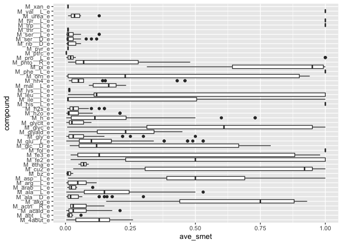
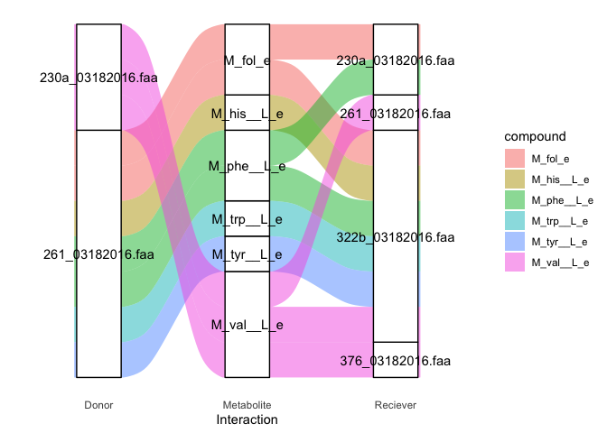

plot\_smetana\_detailed
================
Francisco Zorrilla
15/01/2022

## Packages

``` r
library(tidyverse) # data manipulation
```

    ## ── Attaching packages ─────────────────────────────────────── tidyverse 1.3.1 ──

    ## ✓ ggplot2 3.3.5     ✓ purrr   0.3.4
    ## ✓ tibble  3.1.5     ✓ dplyr   1.0.7
    ## ✓ tidyr   1.1.4     ✓ stringr 1.4.0
    ## ✓ readr   2.0.2     ✓ forcats 0.5.1

    ## Warning: package 'tibble' was built under R version 4.1.1

    ## Warning: package 'tidyr' was built under R version 4.1.1

    ## Warning: package 'readr' was built under R version 4.1.1

    ## ── Conflicts ────────────────────────────────────────── tidyverse_conflicts() ──
    ## x dplyr::filter() masks stats::filter()
    ## x dplyr::lag()    masks stats::lag()

``` r
library(ggpubr) # statistical testing and figure manipulation
library(ggalluvial) # easy alluvial diagrams
```

## SMETANA detailed interactions

We will now generate sankey/alluvial diagrams using the metabolic
predictions from SMETANA.

``` r
## Set working directory inside scripts folder of cloned repo
#setwd("~/path/to/SymbNET/scripts")

# Load data & take average across simulations within each community, remember to unzip smet_all.tsv.gz!
smet_all <- read.delim("../data/smet_all.tsv") %>% 
     select(-medium) %>% 
     group_by(simulation,compound,receiver,donor) %>% 
     mutate(ave_smet = mean(smetana)) %>%
     ungroup() %>%
     select(-simulation,-mps,-mus,-scs,-smetana) %>%
     unique() %>%
     filter(ave_smet!=0) %>%
     mutate(community=as.factor(community))%>%
     mutate(receiver=as.factor(receiver))%>%
     mutate(donor=as.factor(donor))%>%
     mutate(compound=as.factor(compound))

# Summary from data manipulation
summary(smet_all)
```

    ##         community                                          receiver   
    ##  gut_impaired: 739   ERR260140_bin.10.p.faa                    : 438  
    ##  gut_normal  : 191   ERR671933_bin.3.s.faa                     : 420  
    ##  gut_refseq  : 587   ERR260140_bin.19.p.faa                    : 334  
    ##  gut_t2d     :1477   GCF_002834225.1_ASM283422v1_protein.faa.gz: 324  
    ##  kefir       : 994   ERR671933_bin.1.o.faa                     : 307  
    ##  soil        :1372   ERR260140_bin.11.s.faa                    : 300  
    ##                      (Other)                                   :3237  
    ##                     donor            compound       ave_smet       
    ##  ERR260140_bin.3.s.faa : 525   M_h_e     : 480   Min.   :0.003333  
    ##  ERR260140_bin.13.s.faa: 489   M_acald_e : 422   1st Qu.:0.024000  
    ##  ERR260172_bin.10.p.faa: 359   M_ala__D_e: 370   Median :0.078000  
    ##  ERR671933_bin.1.o.faa : 338   M_ala__L_e: 351   Mean   :0.171537  
    ##  ERR671933_bin.4.o.faa : 335   M_nh4_e   : 345   3rd Qu.:0.213333  
    ##  ERR671933_bin.5.s.faa : 311   M_h2o_e   : 307   Max.   :1.000000  
    ##  (Other)               :3003   (Other)   :3085

# Kefir community

We already have some clues as to what interactions may be occurring in
this community from the original publication (see,
<https://www.nature.com/articles/s41564-020-00816-5>). As an exploratory
first step, plot the distribution of average SMETANA scores across
metabolites.

``` r
ggplot(smet_all %>% filter(community =="kefir"),aes(x=compound,y=ave_smet)) + geom_boxplot() + coord_flip()
```

<!-- -->

We need to filter down to some metabolites of interest to get a
reasonable plot (try removing the metabolite filter to see what I mean)

``` r
# filter by compound list
mets = c("M_val__L_e","M_tyr__L_e","M_trp__L_e","M_his__L_e","M_phe__L_e","M_fol_e")

# Plot kefir
ggplot(smet_all %>% filter(community =="kefir",compound%in%mets),
       aes(axis1 = donor, axis2 = compound, axis3 = receiver,
           y = ave_smet)) +
    scale_x_discrete(limits = c("Donor", "Metabolite", "Reciever")) +
    xlab("Interaction") +
    geom_alluvium(aes(fill = compound)) +
    geom_stratum(width=0.3) +
    theme_minimal() + geom_text(stat = "stratum", aes(label = after_stat(stratum)),min.y=0.2)+theme_bw() + 
    theme(panel.border = element_blank(), panel.grid.major = element_blank(),panel.grid.minor = element_blank(), axis.line = element_line(colour = "black"),axis.line.y = element_blank(),axis.ticks.y = element_blank(),axis.text.y = element_blank(),axis.title.y = element_blank(),axis.line.x = element_blank(),axis.ticks.x = element_blank())
```

    ## Warning in to_lodes_form(data = data, axes = axis_ind, discern =
    ## params$discern): Some strata appear at multiple axes.

    ## Warning in to_lodes_form(data = data, axes = axis_ind, discern =
    ## params$discern): Some strata appear at multiple axes.

    ## Warning in to_lodes_form(data = data, axes = axis_ind, discern =
    ## params$discern): Some strata appear at multiple axes.

<!-- -->

## R Markdown

This is an R Markdown document. Markdown is a simple formatting syntax
for authoring HTML, PDF, and MS Word documents. For more details on
using R Markdown see <http://rmarkdown.rstudio.com>.
